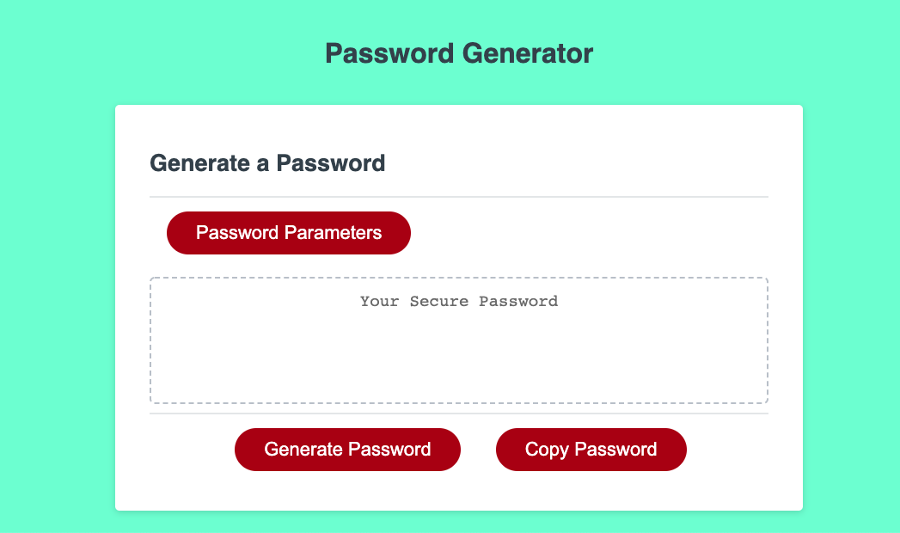

# 03 JavaScript: Password Generator

After making sure the html was set up with the correct forms and buttons I wanted inside a card, I used javascript to prompt the user to confirm the components they wanted in their new password. I then used booleans to keep track of the users criteria and then added the "true" criteria to an array called availableChar. I then used math.Random to randomly select the components of the password until the user-specified length was reached and then I presented the new generated password on the screen.

## Technologies

html
javascript
css

## Deployed

Website:
https://asegre18.github.io/homework3/

GitHub Repo:
https://github.com/asegre18/homework3

Screenshot of Website:

